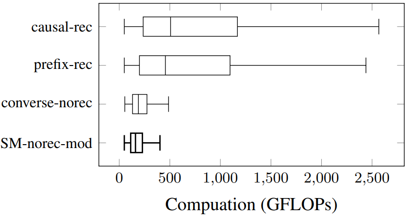

# Simultaneous Masking, Not Prompting Optimization: A Paradigm Shift in Fine-tuning LLMs for Simultaneous Translation

Large language models (LLMs) have achieved state-of-the-art performance in various language processing tasks, motivating their adoption in simultaneous translation. Current finetuning methods to adapt LLMs for simultaneous translation focus on prompting optimization strategies using either data augmentation or prompt structure modifications. However, these methods suffer from several issues, such as unnecessarily expanded training sets, computational inefficiency from dumping the key and value cache, increased prompt sizes, or restriction to a single decision policy. To eliminate these issues, in this work, we propose SimulMask, a new paradigm for fine-tuning LLMs for simultaneous translation. It utilizes a novel attention mask approach that models simultaneous translation during fine-tuning by masking attention for a desired decision policy. Applying the proposed SimulMask on a Falcon LLM for the IWSLT 2017 dataset, we have observed a significant translation quality improvement compared to state-of-the-art prompting optimization strategies on five language pairs while reducing the computational cost.

---

## Fine-tuning

The script used to fine-tune a falcon-1.3B model using SimulMask is provided below.  
```
python cli/finetune.py \
    --model tiiuae/falcon-rw-1b \
    --training-set iwslt2017 --training-subset iwslt2017-en-fr \
    --source-lang en --target-lang fr \
    --bnb-4bit-compute-dtype bfloat16 \
    --bsz 16 --update-freq 4 \
    --optim paged_adamw_32bit --lr 2e-4 --lr-scheduler inverse_sqrt --weight-decay 0.1 \
    --warmup-ratio 0.03 --max-grad-norm 1 \
    --save-strategy epoch --eval-interval 10000 --log-interval 1000 --num-train-epochs 2 \
    --max-seq-length 512 --waitk 9 --attmask-type simul \
    --user-dir examples/simulmask \
    --output-dir ${checkpoint_save_path} \
```

The Falcon model checkpoints fine-tuned at wait-9 and evaluated at wait-5 are provided below.
| en-fr | en-nl | en-it |
| ----- | ----- | ----- |
| [falcon-chkpt](https://huggingface.co/raffelm/falcon-simulmask-en-fr) | [falcon-chkpt](https://huggingface.co/raffelm/falcon-simulmask-en-nl) | [falcon-chkpt](https://huggingface.co/raffelm/falcon-simulmask-en-it) |

---


A Bloomz model checkpoint fine-tuned at wait-7 and evaluated at wait-3 is provided below.
| en-fr |
| ----- |
| [bloomz-chkpt](https://huggingface.co/raffelm/bloomz-simulmask-en-fr)

## Evaluation
The script used to evaluate a fine-tuned falcon-1.3B model is provided below.

```
python3 cli/simuleval_wrapper.py \
    --agent examples/simulmask/falcon_simulmask_agent.py \
    --source ${source_data_path} \
    --target ${target_data_path} \
    --source-lang en --target-lang fr \
    --model ${checkpoint_save_path} \
    --output ${eval_save_path} \
    --waitk 5 --device cuda --attmask-type causal \
    --compute-dtype bfloat16 --quality-metric BLEU CHRF \
```
---

## Results

### Translation Quality and Latency Results

The LLM Fine-tuned with SimulMask outperforms or matches alternative approaches in terms of translation quality.

| English-French | English-Dutch  | English-Italian  |
|---------|---------|---------|
|  |  |  |

| English-German | English-Romanian  |
|---------|---------|
|  |  |

---
### Computational Saving Results

Fine-tuning an LLM with SimulMask reduces training time compared to alternative approaches.

 

The LLM fine-tuned with SimulMask performs inference at a reduced computational cost compared to alternative approaches.

 

---

## Citation

When employing or extending SimulMask, please consider citing us as:

```
@inproceedings{raffel-etal-2024-simultaneous,
    title = "Simultaneous Masking, Not Prompting Optimization: A Paradigm Shift in Fine-tuning {LLM}s for Simultaneous Translation",
    author = "Raffel, Matthew  and Agostinelli, Victor  and Chen, Lizhong",
    editor = "Al-Onaizan, Yaser  and Bansal, Mohit  and Chen, Yun-Nung",
    booktitle = "Proceedings of the 2024 Conference on Empirical Methods in Natural Language Processing",
    month = nov,
    year = "2024",
    address = "Miami, Florida, USA",
    publisher = "Association for Computational Linguistics",
    url = "https://aclanthology.org/2024.emnlp-main.1017/",
    doi = "10.18653/v1/2024.emnlp-main.1017",
    pages = "18302--18314",
}
```
